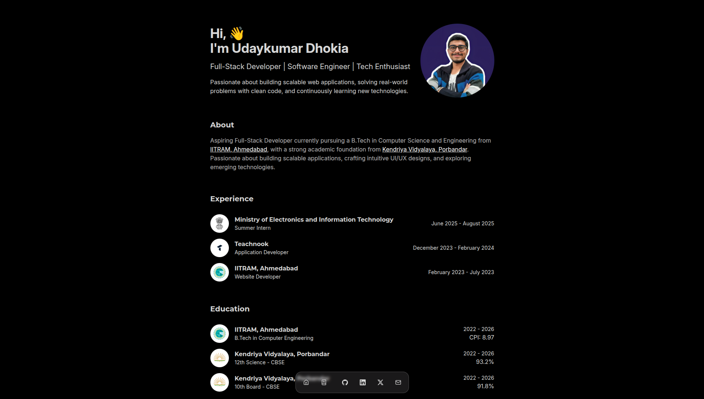

# Portfolio



A modern, responsive portfolio built with **React**, **TypeScript**, **Vite**, and **Tailwind CSS**. Showcases projects, experience, education, skills, and more.

## Features

- ⚡ Fast, optimized, and fully responsive
- 🎨 Styled with Tailwind CSS and DaisyUI
- 🧩 Modular React components
- 🛠️ Modern tech stack: React, TypeScript, Vite
- 🏆 LeetCode stats integration
- 🖱️ Interactive dock navigation
- 🌙 Dark mode support

## Getting Started

### Prerequisites

- [Node.js](https://nodejs.org/) (v18+ recommended)
- [npm](https://www.npmjs.com/) or [yarn](https://yarnpkg.com/)

### Installation

Clone the repository:

```sh
git clone https://github.com/udaykumar-dhokia/portfolio.git
cd portfolio
```

Install dependencies:

```sh
npm install
# or
yarn install
```

### Development

Start the development server:

```sh
npm run dev
# or
yarn dev
```

Open [http://localhost:5173](http://localhost:5173) in your browser.

### Build

To build for production:

```sh
npm run build
```

Preview the production build:

```sh
npm run preview
```

## Project Structure

- `src/` – Main source code
  - `components/` – UI and page components
  - `assets/` – Images and static assets
  - `lib/` – Utility functions
- `public/` – Static files
- `leetcode/` – LeetCode proxy server (Node.js/Express)

## LeetCode Stats Proxy

To enable LeetCode stats, run the proxy server:

```sh
cd leetcode
npm install
node proxy.js
```

Update the API endpoint in `src/components/LeetcodeRank.tsx` if needed.

## Customization

- Update your details in the components under `src/components/`
- Replace images in `src/assets/`
- Edit styles in `src/index.css`

## Tech Stack

- [React](https://react.dev/)
- [TypeScript](https://www.typescriptlang.org/)
- [Vite](https://vitejs.dev/)
- [Tailwind CSS](https://tailwindcss.com/)
- [DaisyUI](https://daisyui.com/)
- [Motion One](https://motion.dev/)


---

Made with ❤️ by [Udaykumar Dhokia](https://github.com/udaykumar-dhokia)
